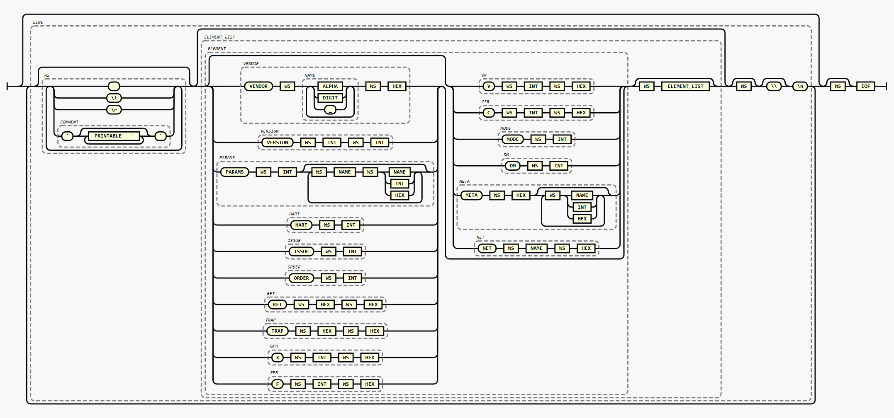

# RVVI-TEXT RISC-V Text trace format

Version 0.1 draft

## Introduction

The RVVI-TEXT format is designed to provide a standardized way to represent
RVVI-TRACE verification traces. This format facilitates the exchange of trace
data between different tools and environments, ensuring consistency and
interoperability in RISC-V verification workflows. By utilizing a clear and
structured text format, users can easily analyze and visualize trace data,
making it an essential component for RISC-V verification and debugging
processes.

> Note: This specification assumes that the reader is familiar with the
> RVVI-TRACE specification. Please familiarize yourself with that specification
> first as most concepts are tightly coupled.


## Description

The RVVI-TEXT format is a text-based, human-readable trace format that is part
of the RVVI specification. While it is primarily designed for human readability,
its structured format also makes it suitable for machine parsing.

The RVVI-TEXT trace file serves as a textual representation of the RVVI-Trace
interface, capturing and conveying its data over time.

Each line in a trace log is made up of zero or more elements that populate the
RVVI-Trace interface with data. Each element typically comprises a key followed by
one or more associated values. The following elements are defined:
```
- VENDOR  <name> <version>
- VERSION <major> <minor>
- PARAMS  <count> [ <key> <value> ... ]
- HART    <hartId>
- ISSUE   <retireslot>
- ORDER   <order>
- RET     <pc> <instBin>
- TRAP    <pc> <instBin>
- X       <index> <value>
- F       <index> <value>
- V       <index> <value>
- C       <index> <value>
- MODE    <code>
- DM      <value>
- NET     <name> <value>
- META    <count> [ <tokens> ... ]
```


## Sscanf style element types

The following format specifiers should be used when emitting or consuming
elements via any SystemVerilog format string functions.
```
VENDOR  %s %d %d             // vendor field         <name> <major> <minor>
VERSION %d %d                // version field        <major> <minor>
PARAMS  %d [ %s %s/%h/%d ]   // params field
HART    %d                   // latch Hart           <hartId>
ISSUE   %d                   // retire slot          <retire slot>
ORDER   %d                   // order field          <order>
RET     %h %h                // retirement event     <pc> <instBin>
TRAP    %h %h                // trap event           <pc> <instBin>
X       %d %h                // GPR change           <register> <value>
F       %d %h                // FPR change           <register> <value>
V       %h %h                // VR change            <register> <value>
C       %h %h                // CSR change           <register> <value>
NET     %s %h                // NET change           <name> <value>
DM      %h                   // debug mode           <value>
MODE    %h                   // privilege mode       <value>
META    %d [ %s/%h/%d ]      // META event           <count> [ count tokens ... ]
```

> Note: Hexadecimal values must be interpreted most-significant-byte (MSB) first
> (leftmost). This aligns with the SystemVerilog %h format specifier byte
> ordering.

### VENDOR

A `VENDOR` element provides a string identifying the software that produced of
the trace file as well as the software version. Typically this will be one of
the first elements in a trace file. This information can be used to decide how
to handle any `META` elements, which are defined bellow.

### VERSION

The `VERSION` element provides the major and minor version number of the
RVVI-TEXT spec that this trace file adheres to. This element can be used for
checking trace file compatibility or enabling backwards compatibility.

### PARAMS

The `PARAMS` element contains information about the RVVI-TRACE interface
parameters, such as XLEN, FLEN, VLEN, etc. This information can be used as part
of a consistency check when replaying information from a trace file into the
RVVI-TRACE interface. If any of these parameters do not match then the trace
data may not be interpreted correctly during replay.

The first value supplied to `PARAMS` is a count, which represents the number of
key-value pairs that will follow. Key is alway a string type and value is
dependent on the key. The currently defined legal key-value pairs are:
```
ILEN    <int>
XLEN    <int>
FLEN    <int>
VLEN    <int>
NHART   <int>
NRETIRE <int>
```

For RVVI-TRACE file producers, it is recommended that the PARAMS element be
emitted to the trace file before any processor execution traces.

### HART

A `HART` element specifies the HartId that subsequent elements apply to until
`HART` is again specified. The default HartId is 0 until changed.

### ISSUE

Some processors can retire multiple instructions during one valid event. The
RVVI-TRACE interface provides for this with the `RETIRE` parameter dimension.

RVVI-TEXT encodes this by outputting two or more `RET` events to the same `HART`
within the same valid event.

RVVI-TEXT has a notional `RETIRE` index, which latches the current index used
for the `RETIRE` dimension when writing data into the RVVI-TRACE interface.

The value of the `RETIRE` index in RVVI-TRACE is often predictable, and so to
reduce the information that RVVI-TEXT contains, the `RETIRE` index is
automatically updated. If the automatic calculation does not fit with the actual
`RETIRE` index required, then `ISSUE` elements should be output to RVVI-TEXT to
override it.

The algorithm is as follows: 
- When a new RVVI-TRACE valid event begins, the `RETIRE` slot is assumed to have
  been cleared to zero.
- During and after the first retirement/trap, the `RETIRE` slot will remain
  zero.
- During and after following retirement/trap events the `RETIRE` slot will be
  incremented by one.
- If the current hart is changed by issuing a `HART` element, then the `RETIRE`
  slot will be reset to zero.

This ensures that a `RET` or `TRAP` event will receive a new retirement slot,
and the data that follows it such as GPR and CSR updates that follow will be
directed to the same retirement slot.

If this algorithm does not correctly predict the required value for the `RETIRE`
slot index, then it should be manually conveyed by outputting an `ISSUE`
element.

An example is provided below.

### ORDER

An `ORDER` element sets the current `order` signal for the currently latched
hart and retirement slot.

The `order` field updates in a predictable manner and so RVVI-TEXT uses an
algorithm to predict its value to reduce occurrences of `ORDER` elements in a
trace file.

The algorithm is as follows:
- For each hart in RVVI-TRACE, RVVI-TEXT tracks a notional order value.
- At the start of tracing the order values are set to zero.
- After each `RET` or `TRAP` event, the following occurs:
  - The RVVI-TRACE `order` field is updated with the current notional order
    value for that hart.
  - The notional order value is then incremented by one.

If this algorithm does not correctly predict the required `order` value, then
it can be overwritten by issuing an `ORDER` element.

An example is provided below.

### RET and TRAP

A `RET` (retirement) or `TRAP` (trap) event sets the valid flag in the
RVVI-Trace interface. A line can be split into multiple lines by inserting the
line continuation character "\\" at its end. After a valid event has been
clocked on the RVVI-Trace interface, the valid signal is assumed to be
de-asserted before a new line is parsed.

### Register change

The `X` (GPR), `F` (FPR), `V` (VR) and `C` (CSR) elements are used to provide
updated register values within each register file respectively. Register file
indices are given in decimal format except for the CSR index which is given in
hex. This is then followed by a value which is always in in hexadecimal format.
The values for floating point registers must be provided as their 32bit, 64bit
or 128bit binary encoded values in hexadecimal format.

### NET

`NET` events communicate net changes on the periphery of the core being traced.
The net name is implementation defined, along with the associated value.

### MODE

`MODE` events communicate the current processor privilege level during a
retirement or trap event. The value of `MODE` should be set according to the
rules specified for the `mode` signal of RVVI-TRACE.

### DM

`DM` events specify if a retirement or trap event occurred in debug mode.

### META

`META` elements provide a mechanism for vendors to implement their own custom
elements. A `META` element starts with a `count` specifying the number of tokens
following which are part of the meta element. Consumers of the trace file can
check the information specified by the VENDOR element to decide how to parse
`META` elements. `META` elements can be skipped over by ignoring all tokens
following the `count` value.

### Comments

Comments can be inserted between any valid tokens and are enclosed in single
quote "'" characters. These comments are entirely ignored when using the RVVI
Trace Log as a machine-readable format and are intended only to annotate the log
with human-readable information, such as disassembly, symbol names, etc. The
content and placement of all comment elements is intentionally unspecified.
Comments are entirely optional and trace log producers are not obliged to
produce them.
A single comment may not span multiple lines.

### Line Breaks

Long lines may be split over multiple lines by issuing a backslash token `\` prior
to a line break. It is not allowed to split one token over multiple lines. A
line break character should not appear on the last line of a valid event.

## RVVI-TRACE valid events

The RVVI-TRACE interface signals to observers that it contains valid information
by raising the `valid` signal. The valid bit is then checked by downstream
observers to determine when they can sample RVVI-TRACE data.

For RVVI-TEXT, the valid bit is raised after a `RET` or `TRAP` event has been
encountered. The RVVI-TRACE clock advances after each unescaped newline is
encountered. In this context, a newline signifies a time advancement. After time
has advanced due to a newline, all valid bits are de-asserted.

This structure means that all information related to a retirement or trap must
be presented on the same logical line as a `RET` or `TRAP` element.

However, line breaks `\` can be used to suppress the clock advancing, to allow
data to be broken up over multiple lines.

## Examples

An example `PARAMS` element for an single hart RV32GCV processor with a VLEN of 256:
```
PARAMS 6 ILEN 32 XLEN 32 FLEN 64 VLEN 256 NHART 1 RETIRE 1
```

The following trace extract shows two RVVI-Trace events, where a single hart
retires two instructions:
```
HART 0 RET 80000b20 40000213 X 4 0000000000000400
HART 0 RET 80000b24 004080b3 X 1 0000000080009840
```

The following example shows a single valid RVVI-Trace event, where two harts
each retire different instructions:
```
HART 0 RET 80 3e800093 HART 1 RET 10080 7d008113
```

The above can be split over multiple lines for readability if desired:
```
HART 0 RET    80 3e800093 \
HART 1 RET 10080 7d008113
```

Comments can be inserted as shown below to provide readers with additional
information. The `HART` element can also be omitted if it is known to be the
currently latched destination hart.
```
RET 80 '_start' 3e800093 'li ra, 1000' X 1 3E8
```

The sequence below shows a trap event, generated due to an unaligned load with
CSR register updates:
```
RET  1012 '_start+18'       07228293 'addi    t0,t0,114'     X  5 't0' 00001080
TRAP 1016 '_start+22'       0012a303 'lw      t1,1(t0)'      C 300 'mstatus' 00003800 C 341 'mepc' 00001016 C 342 'mcause' 00000004 C 343 'mtval' 00001081
RET  1040 'trap_handler+0'  34029073 'csrw    mscratch,t0'   C 340 'mscratch' 00001080
```

Meta elements can be used to encapsulate data that may be relevant to a
particular trace file vendor and their processor design and workflow. In the
example below, a hypothetical `META` event is shown which annotates store
instructions with a virtual address and data contents.
```
RET  101a '_start+26'       00000297 'auipc   t0,0x0'        X  5 't0' 0000101a
RET  101e '_start+30'       06628293 'addi    t0,t0,102'     X  5 't0' 00001080
RET  1022 '_start+34'       deafd337 'lui     t1,0xdeafd'    X  6 't1' deafd000
RET  1026 '_start+38'       afe30313 'addi    t1,t1,-1282'   X  6 't1' deafcafe
RET  102a '_start+42'       0062a1a3 'sw      t1,3(t0)'      META 4 VMEM 1083 4 deafcafe
```

The following example shows a single hart retiring multiple instructions within
the same valid event. The RVVI-TRACE retirement slot starts at 0, and after the
first retirement event has been read, it increments to 1 before the second
retirement event. Each retirement slot has its own ORDER counter that auto
increments after each retirement event as described above.
```
HART 0 \
    ISSUE 0 RET 80 00000093 'li ra,0' \
    ISSUE 1 RET 84 00000113 'li sp,0'
```

Using the auto-increment rules this can also be encoded as follows:
```
HART 0 RET 80 00000093 'li ra,0' RET 84 00000113 'li sp,0'
```

The `RVVI-TRACE` `order` can be manually specified when required:
```
HART 0 \
    ISSUE 1 ORDER 1 RET 80 00000093 'li ra,0' \
    ISSUE 0 ORDER 0 RET 84 00000113 'li sp,0'
```
This overrides the algorithm used by RVVI-TEXT to predict its next value.

## eBNF (ISO/IEC 14977 EBNF notation)

> Online viewer: https://matthijsgroen.github.io/ebnf2railroad/try-yourself.html

```
COMMENT    = "'", { PRINTABLE - "'" }, "'" ;
NAME       = { ALPHA | DIGIT | "_" }- ;
WS         = { " " | "\t" | "\r" | COMMENT }- ;

VENDOR     = "VENDOR",  WS, NAME, WS, HEX ;
VERSION    = "VERSION", WS, INT, WS, INT ;
PARAMS     = "PARAMS",  WS, INT, { WS, NAME, WS, (NAME | INT | HEX) } ;
HART       = "HART",    WS, INT ;
ISSUE      = "ISSUE",   WS, INT ;
ORDER      = "ORDER",   WS, INT ;
RET        = "RET",     WS, HEX, WS, HEX ;
TRAP       = "TRAP",    WS, HEX, WS, HEX ;
GPR        = "X",       WS, INT, WS, HEX ;
FPR        = "F",       WS, INT, WS, HEX ;
VR         = "V",       WS, INT, WS, HEX ;
CSR        = "C",       WS, INT, WS, HEX ;
MODE       = "MODE",    WS, INT ;
DM         = "DM",      WS, INT ;
META       = "META",    WS, HEX, { WS, (NAME | INT | HEX) } ;
NET        = "NET",     WS, NAME, WS, HEX ;

ELEMENT    = VENDOR
           | VERSION
           | PARAMS
           | HART
           | ISSUE
           | ORDER
           | RET
           | TRAP
           | GPR
           | FPR
           | VR
           | CSR
           | MODE
           | DM
           | META
           | NET ;

ELEMENT_LIST = ELEMENT, WS, ELEMENT_LIST
             | ELEMENT ;

LINE       = [ WS ], [ ELEMENT_LIST ], [ WS ], [ "\\" ], "\n" ;
TRACE      = { LINE }, [ WS ], EOF ;
```


## Railroad (ISO/IEC 14977)


