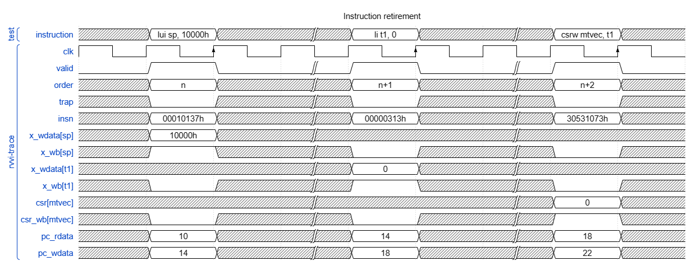
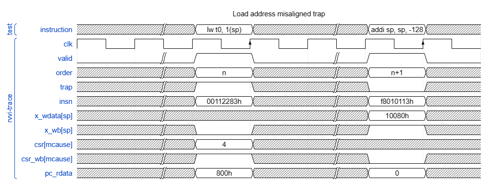
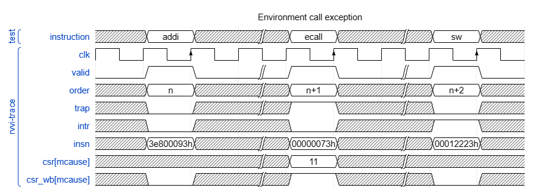
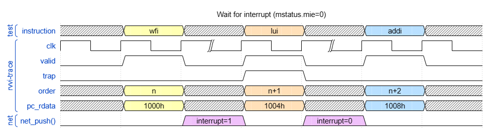
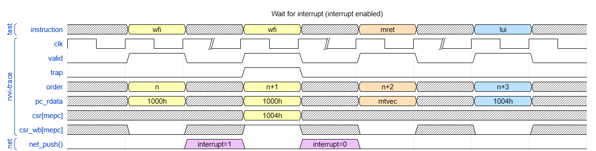

# RVVI-TRACE RISC-V Verification Interface

Version 1.5

This is a work in progress

----
## Overview

The following specification defines a method of observing a RISC-V
implementation. Observation of the internal state is required, in addition to
asynchronous event changes on items such as Interrupts and Debug nets.

The primary RVVI-TRACE interface, `rvviTrace`, is specified in the following
file:
- [/source/host/rvvi/rvviTrace.sv](../source/host/rvvi/rvviTrace.sv)

A number of illustrative waveform diagrams are provided in the [Example Waveforms](#example-waveform-diagrams) section.

----
## rvviTrace Interface parameters

The `rvviTrace` interface takes a number of parameters which are defined as follows:

| Param. Name | Description                                                                  |
| ----------- | ---------------------------------------------------------------------------- |
| `ILEN`      | The maximum permissible instruction length in bits.                          |
| `XLEN`      | The maximum permissible General purpose register size in bits.               |
| `FLEN`      | The maximum permissible Floating point register size in bits.                |
| `VLEN`      | The maximum permissible Vector register size in bits.                        |
| `NHART`     | The number of harts that will be reported on this interface.                 |
| `RETIRE`    | The maximum number of instructions that can be retired during a valid event. |

----
## rvviTrace Interface ports

This interface provides internal visibility of the state of the RISC-V device.
All signals on the RVVI interface are outputs from the device, for observing
state transitions and state values.

Please note that the data conveyed on this interface should not be relied upon
to persist beyond an individual event.

### `clk`
The RVVI Trace interface is synchronous to the positive edge of the clk
signal. The interface should only be sampled on the positive edge of this
clock signal.

### `valid`
When this signal is true, an event is being communicated on the RVVI-TRACE
interface. An event may be, for example, that an instruction has been retired or
has trapped, and any changed processor state will also be communicated
accordingly, this includes the Integer/GPR, Float/FPR, Vector/VR
CSR and any other supported registers. The instruction address which retired is
indicated by the pc_rdata variable.

### `order`
This signal contains the event count for the event being reported during a retirement or 
trap event. The value of order should monotonically repeat with no gaps or repeats

### `insn`
This signal contains the instruction word which is at the trap or retirement
event. The instruction word should always be reported with little-endian byte
ordering regardless of the mstatus.mbe field or endianness of the processor.

### `trap`
When this signal is true along with `valid`, instruction execution has resulted
in an exception to program execution to occur . This event allows the state of the
DUT to be conveyed between instruction retirements. The address of the
instruction which trapped is indicated by the `pc_rdata` variable. If this
signal is false when `valid` is asserted, then an instruction has instead
retired normally. State comparison will only occur upon instruction retirement (trap=0)

### `halt`
When this signal is true, it indicates that the hart has entered a halted
state as a result of executing this instruction.

### `intr`
When this signal is true, it indicates that this retired instruction is the
first instruction which is part of a trap handler.

### `mode`

The `mode` signal combined with the `mode_virt` signal indicates the operating
mode of the processor during the current RVVI event.

If the RISC-V Hypervisor Extension is absent then `mode_virt` should be set to 0
and `mode` is interpreted as follows:

| name       | `mode`  |
|------------|---------|
| USER       | 0       |
| SUPERVISOR | 1       |
| MACHINE    | 3       |

If the RISC-V Hypervisor Extension is present then the following table applies:

| name                                  | `mode`  | `mode_virt` |
|---------------------------------------|---------|-------------|
| USER                                  | 0       | 0           |
| HYPERVISOR-EXTENDED SUPERVISOR        | 1       | 0           |
| MACHINE                               | 3       | 0           |
| VIRTUAL USER                          | 0       | 1           |
| VIRTUAL SUPERVISOR                    | 1       | 1           |

All other combinations are currently undefined within the RVVI specification.

### `mode_virt`
See description for `mode`.

### `ixl`
This signal indicates the current `XLEN` for the given privilege mode of
operation.

### `pc_rdata`
This is the address of the instruction at the point of a `valid` event (trap
or retirement).

### `pc_wdata`
This is the address of the next instruction to be executed after a trap or
retirement event.

### `x_wdata`, `x_wb`
If the bit position within `x_wb` is true, then the position indicates a write
into X, eg if `x_wb=0x4`, then the register X2 has been written. If
`x_wb=(1<<4 | 1<<1)` then register X4 and X1 have been written concurrently
x_wb=0x0 indicates no written X register. If `x_wb` is false, then the contents
is undefined.

### `f_wdata`, `f_wb`
If the bit position within `f_wb` is true, then the position indicates a write
into F, eg if `f_wb=0x4`, then the register F2 has been written. If
`f_wb=(1<<4 | 1<<1)` then register F4 and F1 have been written concurrently
f_wb=0x0 indicates no written F register. If `f_wb` is false, then the contents
is undefined.

### `v_wdata`, `v_wb`
If the bit position within `v_wb` is true, then the position indicates a write
into V, eg if `v_wb=0x4`, then the register V2 has been written. If
`v_wb=(1<<4 | 1<<1)` then register V4 and V1 have been written concurrently
v_wb=0x0 indicates no written V register. If `v_wb` is false, then the contents
is undefined.

### `csr`, `csr_wb`
If the bit position within `csr_wb` is true, then a the position indicates a
write into csr, eg if `csr_wb=0x1`, then the ustatus register (address 0x000)
has been written. If `csr_wb=(1<<4 | 1<<0)` then address 0x004 and 0x001 have
been written concurrently csr_wb=0x0 indicates no written csr. If `csr_wb` is
false, then the contents is undefined.

### `lrsc_cancel`
If this signal is true then this indicates that the reference model should
clear any current LR/SC reservation _after_ the retirement of the current
instruction. This signal should _NOT_ be used to indicate reservation
cancellations caused by the normal operation of the `SC` instruction. Use of
this signal is only to propagate _implementation defined_ cancellations to the
reference model.

### `debug_mode`
This signal should be driven true if the current instruction retirement event
takes place when the processor is operating in debug mode. This signal should be
driven false otherwise.

----
## rvviTrace Interface functions

### `net_push()`
The `net_push` function is used to submit the status of a processor net to the
`rvviTrace` interface. Nets are formed as a key/value pair, consisting of the
net name `vname` and the net value `vvalue`. Calls to this function will push
these key value pairs into a fifo, which will be emptied by an RVVI interface
consumer.

### `net_pop()`
The `net_pop` function is used by a consumer of the RVVI interface to receive
any net status updates. Net changes are popped in the order that they have been
pushed (FIFO). This function returns 1 when a net change has been popped
successfully, or 0 if there was no net change to pop.

----
## Example waveform diagrams

A number of example waveform diagrams showing RVVI-TRACE event sequences is
provided for clarity. Please note that a reduced set of signals is shown in
these examples for the sake of brevity and a real implementation would be
expected to drive all required.

### Instruction retirement

The diagram above shows a number of instructions being retired, with GPR and CSR
register file writes being communicated as a result.

### Load address misaligned

The diagram above shows a processor taking a synchronous exception due to the
execution of a load word instruction from a non-aligned memory address.

### Environment call exception

The diagram above shows a processor executing an ECALL instruction.

> _RISC-V privileged specification 20211203, section 3.3.1:_
>
> As ECALL and EBREAK cause synchronous exceptions, they are not considered to
> retire, and should not increment the minstret CSR.

Execution of an ECALL instruction results in a trap being raised and the
instruction does not retire. Thus a trap event should be presented on the
RVVI-TRACE interface, with the `trap` signal being asserted, and all relevant
CSRs modified by the trap being provided.

### Resume from WFI

The diagram above shows a processor retiring a WFI instruction. The processor
then resumes from its halted state because an interrupt net has been asserted.
Since the global interrupt enable is 0, no interrupt is taken.

With interrupts enabled as shown above, the processor resumes from the WFI and
branches to the trap handler.
